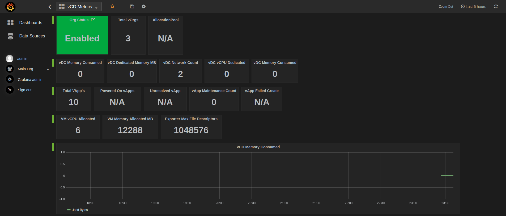

# vcd_exporter

VMware VCD Exporter for Prometheus. 

## Badges

## Grafana Dashboard



## Install

You can do the following to install this exporter:

***Note*** This is only tested working with python3.6

* Install locally

```
$> python setup.py install
$> python -m vcd_exporter -c /path/to/your/config
```

* Install via pip

```
$> python -m pip install vcd-exporter
```

* Run via Docker container

```
docker run -it --rm  -p 9273:9273 -e VCD_USER=${VCD_USERNAME} -e VCD_PASSWORD=${VCD_PASSWORD} -e VCD_IGNORE_SSL=True --name vcd_exporter registry.gitlab.com/frenchtoasters/vcd_exporter:latest -p 9273
```

## Configuration 

You should only provide a configuration file if the environment variables are not going to be set. If you are going to use a configuration file use a volume like so:

```
docker run -it --rm  -p 9273:9273 -v $PWD/vcd_config:/path/to/config --name vcd_exporter registry.gitlab.com/frenchtoasters/vcd_exporter:latest -p 9273 -c /path/to/config
```


The following is what an example `vcd_config.yml` file would look like:

```
default:
    vcd_host: "vcd.host.com"
    vcd_org: "tenant"
    vcd_user: "user"
    vcd_password: "password"
    ignore_ssl: False # Inverse of what you want to use atm
```

### Environment Variables

| Variable       | Precedence             | Defaults | Description                                       |
|----------------|------------------------|----------|---------------------------------------------------|
| VCD_HOST       | config, env            | n/a      | Url to vCD instance                               |
| VCD_ORG        | config, env            | n/a      | vCD tenant                                        |
| VCD_USER       | config, env            | n/a      | User for connecting to vcd                        |
| VCD_PASSWORD   | config, env            | n/a      | Password for connecting to vcd                    |
| VCD_IGNORE_SSL | config, env            | False    | Ignore the ssl cert on the connection to vcd host |


### Prometheus configuration

The following the base Prometheus configuration file.

```
  # Default config
  - job_name: 'vcd_exporter'
    metrics_path: '/vcd'
    static_configs:
    - targets: ['localhost:9273']
      labels: 
        group: 'vcd-localhost'
  
  # Metrics Config
  - job_name: 'vcd_exporter_metrics'
    static_configs:
    - targets: ['localhost:9273']
      labels: 
        group: 'vcd-gather-metrics'
```

# Metrics

```
# HELP vcd_org_is_enabled {"Description": "Enabled status of Organization", "Enabled": 1, "Disabled": 0}
# TYPE vcd_org_is_enabled gauge
# HELP vcd_vdc_cpu_allocated CPU allocated to vdc
# TYPE vcd_vdc_cpu_allocated gauge
# HELP vcd_vdc_mhz_to_vcpu Mhz to vCPU ratio of vdc
# TYPE vcd_vdc_mhz_to_vcpu gauge
# HELP vcd_vdc_memory_allocated Memory allocated to vdc
# TYPE vcd_vdc_memory_allocated gauge
# HELP vcd_vdc_memory_used_bytes Memory used by vdc in bytes
# TYPE vcd_vdc_memory_used_bytes gauge
# HELP vcd_vdc_used_network_count Number of networks used by vdc
# TYPE vcd_vdc_used_network_count gauge
# HELP vcd_vdc_vapp_status Status of vApp
# TYPE vcd_vdc_vapp_status gauge
# HELP vcd_vdc_vapp_in_maintenance Status of maintenance mode of given vApp
# TYPE vcd_vdc_vapp_in_maintenance gauge
# HELP vcd_vdc_vapp_vm_status Status of VM
# TYPE vcd_vdc_vapp_vm_status gauge
# HELP vcd_vdc_vapp_vm_vcpu vCPU count of vm in given vApp of vdc
# TYPE vcd_vdc_vapp_vm_vcpu gauge
# HELP vcd_vdc_vapp_vm_vcpu_usage Average CPU usage in percents of vm in given vApp of vdc
# TYPE vcd_vdc_vapp_vm_vcpu_usage gauge
# HELP vcd_vdc_vapp_vm_memory_usage Average memory usage in percents of vm in given vApp of vdc
# TYPE vcd_vdc_vapp_vm_memory_usage gauge
# HELP vcd_vdc_vapp_vm_disk_read Average disk read usage in kilobytes of vm in given vApp of vdc
# TYPE vcd_vdc_vapp_vm_disk_read gauge
# HELP vcd_vdc_vapp_vm_disk_write Average disk write usage in kilobytes of vm in given vApp of vdc
# TYPE vcd_vdc_vapp_vm_disk_write gauge
# HELP vcd_vdc_vapp_vm_allocated_memory_mb Memory allocated to VM of given vApp of vdc
# TYPE vcd_vdc_vapp_vm_allocated_memory_mb gauge
```

# v.0.0.2

Added vCloud Director metrics 
```
cpu.usage.average  -> vcd_vdc_vapp_vm_vcpu_usage
mem.usage.average  -> vcd_vdc_vapp_vm_memory_usage
disk.read.average  -> vcd_vdc_vapp_vm_disk_read
disk.write.average -> vcd_vdc_vapp_vm_disk_write
```


# References

The vCloud Director exporter uses the following libraries for data collection:

* [pyvcloud](https://github.com/vmware/pyvcloud) for vCD connection
* Prometheus [client_python](https://github.com/prometheus/client_python) for Prometheus metrics
* [Twisted](https://twistedmatrix.com/trac/) for web server

Original code inspired by:

* https://gitlab.com/markypooch
* https://github.com/rverchere/vmware_exporter
* https://gitlab.com/frenchtoasters/vac_exporter
